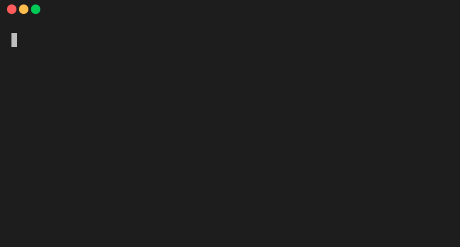

# 🧪 Test Generator CLI

[](https://www.codacy.com/gh/rohitbakoliya/test-gen/dashboard?utm_source=github.com&utm_medium=referral&utm_content=rohitbakoliya/test-gen&utm_campaign=Badge_Grade)


Quickly generate test cases for stress testing using interactive CLI.



## Install

```bash
npm i -g @rohitbakoliya/test-gen
```

or

```bash
npx @rohitbakoliya/test-gen 
# without installing it globally
```

## Usage

```
test-gen
```

## Documentation

Checkout Complete Documentation [here](docs/docs.md).

## Contributing

**Unit test:** Unit test are written in [Jest](https://jestjs.io/). Please add a unit test for every
new feature or bug fix. `npm test` to run the test suite.

**Documentation:** Add output format for every new input types.

## License

This project is under the MIT license.
